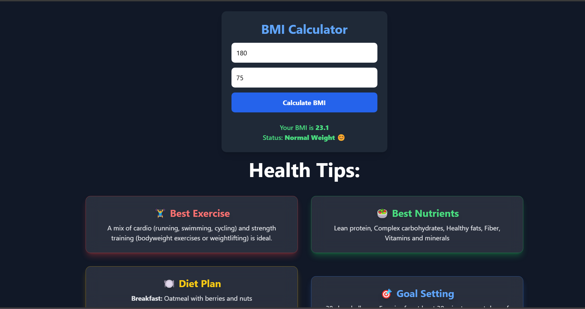

---

## 🏋️‍♂️ BMI Calculator with AI Health Advice

This is a simple **BMI Calculator** that provides personalized **health advice** using AI. It calculates BMI based on user input and fetches **exercise, diet, sleep, and motivational recommendations** from an AI-based backend.

---

## 📌 Features

✅ **Calculate BMI** based on user height & weight.  
✅ **Get AI-based health recommendations** (exercise, diet, sleep, stress management, etc.).  
✅ **Interactive UI with animations** using Tailwind CSS.  
✅ **Smooth hover effects** for better user experience.  
✅ **Real-time advice fetching** from a backend API.  

---

## 🚀 How to Run the Project

### 1️⃣ **Clone the Repository**
```sh
git clone https://github.com/prajjaldhar/MernWithAI2025
cd bmi-calculator-ai
```

### 2️⃣ **Install Dependencies**
Make sure you have **Node.js** installed.

```sh
npm install
```

### 3️⃣ **Start the Backend**
Run the backend server to fetch AI-generated advice.

```sh
node server.js
```

### 4️⃣ **Open `index.html` in Browser**
Simply open the `index.html` file in your browser.

---

## 🛠 Technologies Used

- **HTML, CSS, JavaScript**
- **Tailwind CSS** (for styling)
- **Node.js & Express.js** (for backend API)
- **Fetch API** (for handling API requests)
- **Async/Await** (for smooth API calls)

---

## 📸 UI Preview



---

## 📡 API Endpoint

The app fetches AI-generated advice from the following API:

- **POST** `http://localhost:3000/generate-advice`
  - **Request Body:**
    ```json
    { "bmi": 24.5 }
    ```
  - **Response Example:**
    ```json
    {
      "best_exercise": "Yoga & Cardio",
      "best_nutrients": ["Protein", "Fiber"],
      "diet_chart_plan": {
        "breakfast": "Oatmeal & Fruits",
        "lunch": "Grilled Chicken Salad",
        "dinner": "Steamed Veggies"
      },
      "goal_setting": "Exercise 30 mins daily",
      "sleep_recommendation": {
        "duration": "7-8 hours",
        "recovery_tips": ["No screens before sleep"]
      },
      "common_health_risks": {
        "risks": ["Heart Disease", "Obesity"],
        "prevention_tips": ["Eat healthy", "Exercise"]
      },
      "caloric_intake": "2000 kcal/day",
      "stress_management": ["Meditation", "Journaling"],
      "Lifestyle & Habits Enhancements": {
        "morning_routine": ["Stretching", "Hydration"],
        "night_routine": ["Reading", "Relaxing music"]
      },
      "best_motivational_quotes": "Your body is your temple!"
    }
    ```

---

## 📢 Contribute

Want to contribute? Feel free to submit a **pull request** or report **issues**.

---

## 📞 Contact

📧 Email: [prajjaldhar41@gmail.com](mailto:prajjaldhar41@gmail.com)  
🔗 GitHub: [prjrocks](https://github.com/prajjaldhar)

---

This should be a **good README** for your project! Let me know if you need any further assistance 🚀🔥